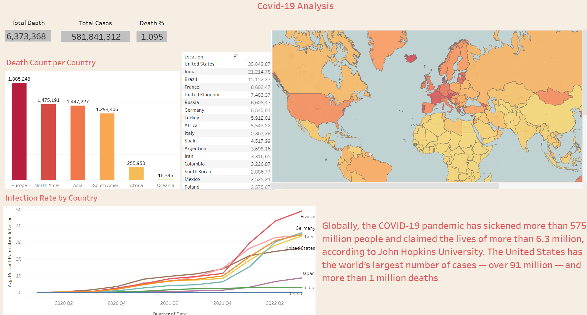

<h1 align="center"> Covid-19 Analysis</h1>
<h3 align="center">The main purpose of this project is to analyse the trend of the pandemic that has caused widespread panic and fear all over the world. </h3>

<h1>
Project Preview
</h1>

Primarily, for this project, I've used SQL for analysing the data.
Also I've created a dashboard using <b>Tableau</b> for visualizing the analysis.

<i>Here's the link to the tableau dashboard: https://public.tableau.com/app/profile/yipu.lerina/viz/Covid-19Analysis_16610107966200/Dashboard1</i>

<i>Link to the dataset: https://ourworldindata.org/coronavirus</i>
