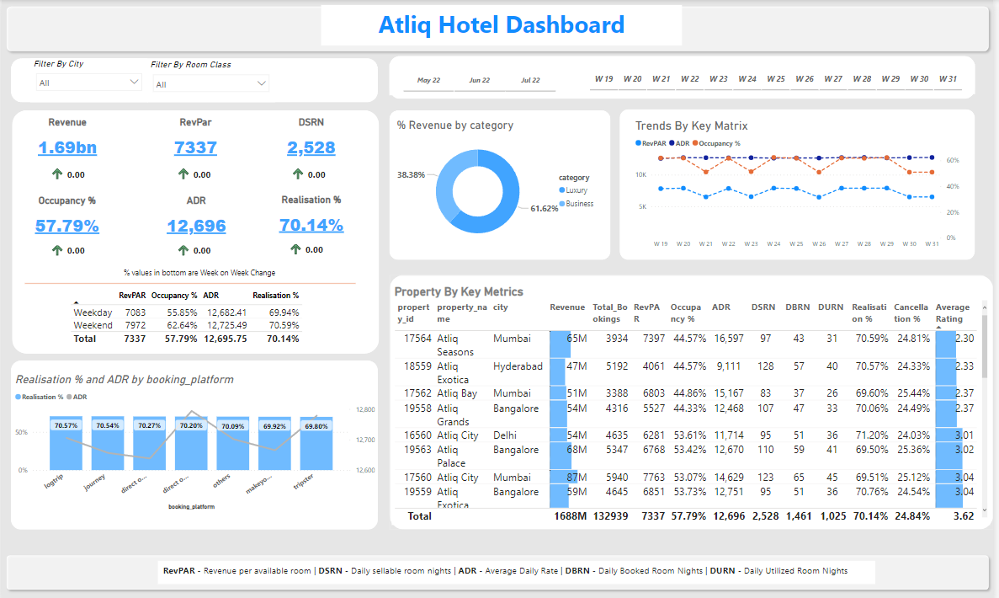
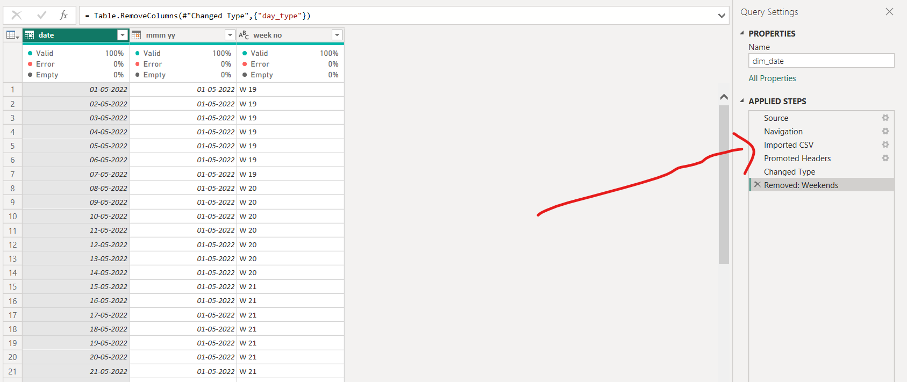
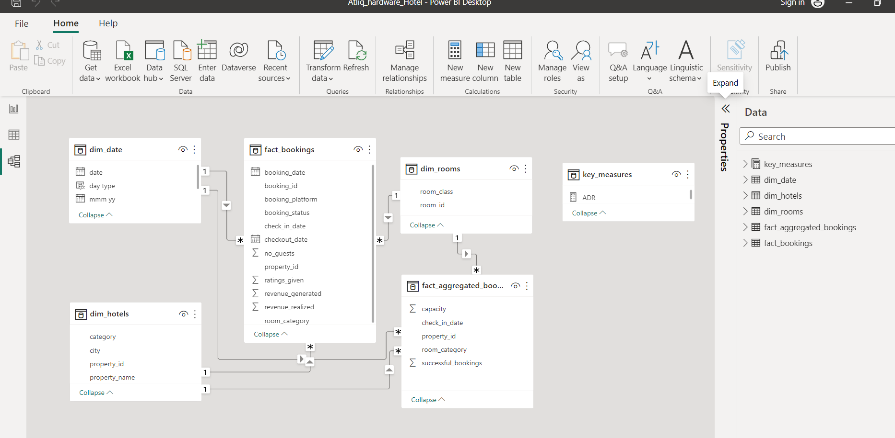
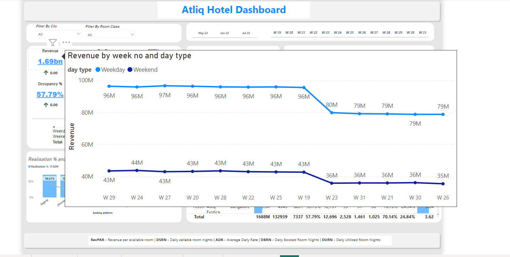

<h1 align="center">  Atliq Hotel Revenue Analysis</h1>
<h3 align="center">This is a project that aims to capture all the underlying key metrices of the hotel industry and help stakeholders better understand their business with the help of Power Bi. </h3>
 

<h1>What this project means to me?
</h1>

When I first heard about this project challenge from code basics asking all data analyst to analyze their data  and create a dashboard using Power BI to help domain experts in Hotel industry. I was all in. 

Overall, this is one of my favorite projects.

 

<h1>
Acknowledgement
</h1>

 Big shotout to Code basics for this awesome data analyst challenge. 🙌

 

<h1>
Project Preview
</h1>

Link to the dataset : https://codebasics.io/resources/end-to-end-data-analyst-project

* Primarily, for this project I used Power Query in Power BI for data cleaning. 

* Created over 20+ measures using DAX functions for making analysis
* Created over 5+ customized tooltips to make better time intelligence analysis 

### Data cleaning: Here's a glimpse of how I used PowerQuery for cleaning the data.

 

### Data modelling:

 

### Customized tooltips for better time intelligence analysis

 

### Key metrices in one table to assist domain experts /stakeholders 

 

<h1>Conclusion
</h1>

 I had a really good time doing this project. The exposure to countless DAX functions was interesting and much needed. What DAX can achieve for making <b>'Time intelligence analysis'</b> is just insanely powerful. There's so many amazing tools out there for making analysis and Power BI is definitely one of my favourite.

