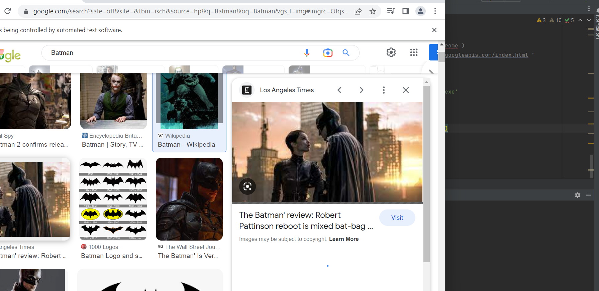

<h1 align="center"> Image Scrapping</h1>
<h3 align="center">A fun project for scraping images using selenium</h3>

<i>Link to the images I've scraped: https://github.com/yipulerina/PortfolioProjects-DataAnalyst/tree/main/ImageScrapper/images</i>

<h1> Project preview
</h1>

Here's a preview of the code I wrote to run the project

<i> Here's the link to code: https://github.com/yipulerina/PortfolioProjects-DataAnalyst/blob/main/ImageScrapper/scraper.py
</i>

