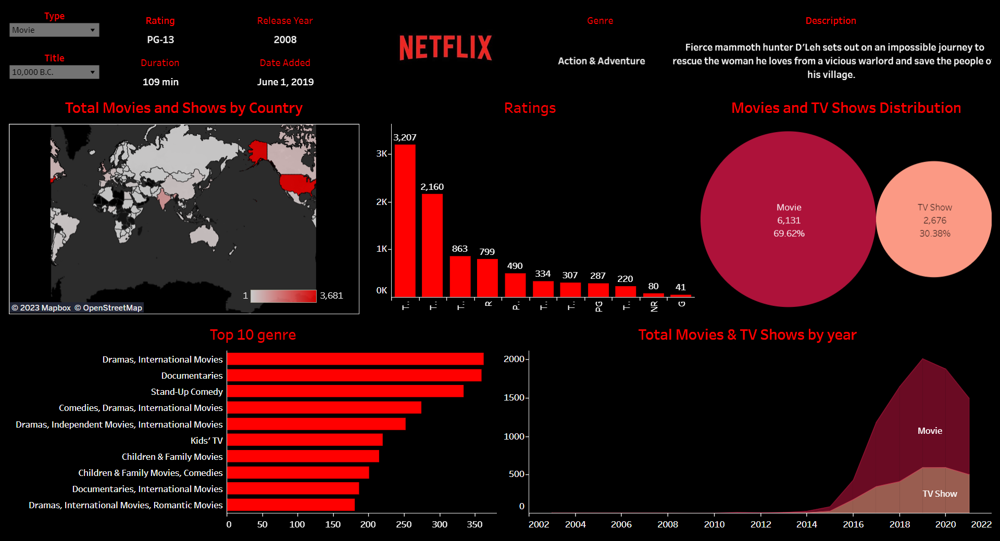

<h1 align="center">  Netflix Exploratory Data Analysis</h1>
<h3 align="center">This is an analysis on the popular netflix dataset available on kaggle . </h3>

<h1>What this project means to me?
</h1>

### Firstly, I love netflix. Not just because it produces great Movies and Tv shows but because it's change the entire film industry and given consumers so much freedom .  I remember those days when I had to wait everyday for the next episode on TV for shows like 'Suits', 'How I met your mother', 'Castle', 'Friends' etc etc... The list goes on.... Ahhh man! I remember the pain of waiting for that next epsiode!  Well, those days are gone!!! Thank you Netflix😁🙌
 

<h1> Project Preview
</h1>

#### <i>Link to the dataset :https://www.kaggle.com/datasets/shivamb/netflix-shows?datasetId=434238&sortBy=voteCount
  
 
 #### Link to tableau dashboard: https://public.tableau.com/app/profile/yipu.lerina/viz/Netflix_Dashboard_16796506435840/Dashboard2?publish=yes</i>

 
 

 ### I used Python for data cleaning and analysis.<i> Pandas, matplotlib and wordcloud </i> were used extensively.
 

  ### Finally I created a dashboard using Tableau for presenting my work.

