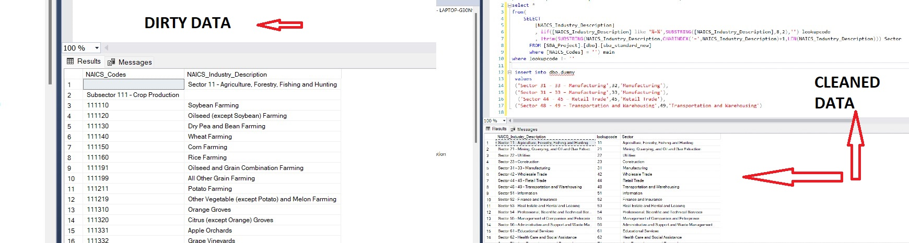

<h1 align="center">  SBA Loan Analysis</h1>
<h3 align="center">This is a project on the Paycheck Protection Programme (PPP):   Covid relief fund that provided small businesses with approximately $800 billion in low-interest uncollateralized loans from April 3, 2020, through May 31, 2021. </h3>

 

## What this project means to me ?
I took up this project as a challenge from my friend. We both are aspiring data analyst and we wanted to prove ourselves to each other. And this was the project he chose for me. I hope I've done justice to this dataset   

<h2> Let's dive in to the analysis</h2>

 <i>Link to the dataset :https://data.sba.gov/dataset/ppp-foia
  Link to tableau dashboard: https://public.tableau.com/app/profile/yipu.lerina/viz/PPPDashboard_16769832978370/Dashboard1?publish=yes</i>

 ### DATA PREPARATION

I used SQL Server Integration Services(SSIS) for creating an ETL package that helped merge 10+csv files (which was over 4+ gb in size) and import it directly to MSSQL SERVER .Here's a glimpse of how I created the ETL package:

 

 I used SQL for data cleaning. Here's a glimpse of it:

<h1>Analysis
</h1>

 1. What is the summary of all PPP approved loans?
 

| Date_Approved | Number_of_Approved  | Approved_Amount  |
| ------------- |:-------------:| -----:|
| 2020      | 5136320 | 	525769754660.653|
| 2021     | 6332097      |   271048233468.138 |

| OriginatingLender	| Number_of_Approved |

| JPMorgan Chase Bank, National Association	| 280145
Bank of America, National Association	| 343488
Truist Bank	| 80445
PNC Bank, National Association	| 73911
Wells Fargo Bank, National Association	| 193018
Manufacturers and Traders Trust Company	| 53321
TD Bank, National Association	| 85711
The Huntington National Bank	| 54456
KeyBank National Association	| 43124
U.S. Bank, National Association	| 108030
Zions Bank, A Division of	| 47748
Cross River Bank	| 193045
Fifth Third Bank	| 39918
Citizens Bank, National Association	| 52999
BMO Harris Bank National Association	| 21980

 

## 2. Top 5 Originating lenders  in 2020

| OriginatingLender | Number_of_Approved | Approved_Amount  |
| ------------- |:-------------:| -----:|
JPMorgan Chase Bank, National Association|	280145 |	29516593851.2638
Bank of America, National Association	|343488|	25384604323.9762
Truist Bank	80445	13070957091.9618
PNC Bank, National Association	|73911|	13064877684.2957
Wells Fargo Bank, National Association	|193018|	10399521767

## 3. Top 5 Originating lenders  in 2021

| OriginatingLender | Number_of_Approved | Approved_Amount  |
| ------------- |:-------------:| -----:|
JPMorgan Chase Bank, National Association	|158420|	12208527587.9785
Bank of America, National Association	|147547|	8934348167
Harvest Small Business Finance, LLC	|402965	|6936199668.88214
Prestamos CDFI, LLC	|443858	|6823303287.2998
Cross River Bank	|285821|	6512122597
