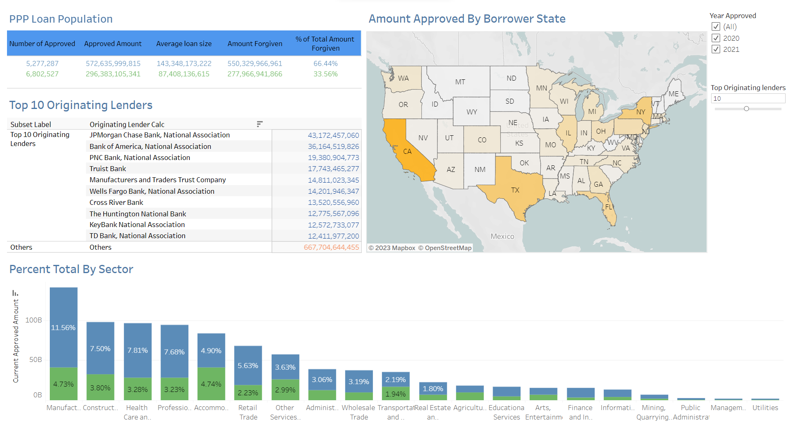

<h1 align="center">  SBA Loan Analysis</h1>
<h3 align="center">This is a project on the Paycheck Protection Programme (PPP):   Covid relief fund that provided small businesses with approximately $800 billion in low-interest uncollateralized loans from April 3, 2020, through May 31, 2021. </h3>

 

## What this project means to me ?
I took up this project as a challenge from my friend. We both are aspiring data analyst and we wanted to prove ourselves to each other. And this was the project he chose for me. I hope I've done justice to this dataset   

<h2> Let's dive in to the analysis</h2>

 <i>Link to the dataset :https://data.sba.gov/dataset/ppp-foia
  Link to tableau dashboard: https://public.tableau.com/app/profile/yipu.lerina/viz/PPPDashboard_16769832978370/Dashboard1?publish=yes</i>

 # DATA PREPARATION

I used SQL Server Integration Services(SSIS) for creating an ETL package that helped merge 10+csv files (which was over 4+ gb in size) and import it directly to MSSQL SERVER .

 Here's a glimpse of how I created the ETL package:

